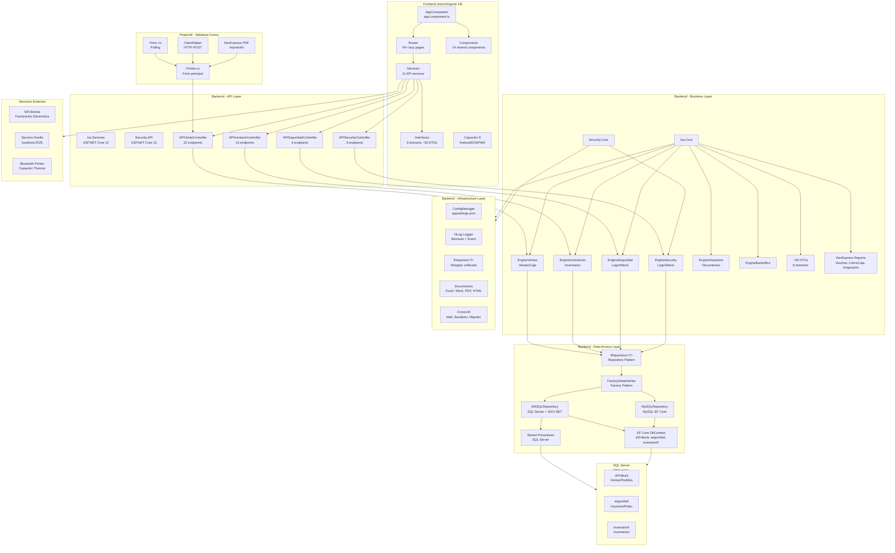
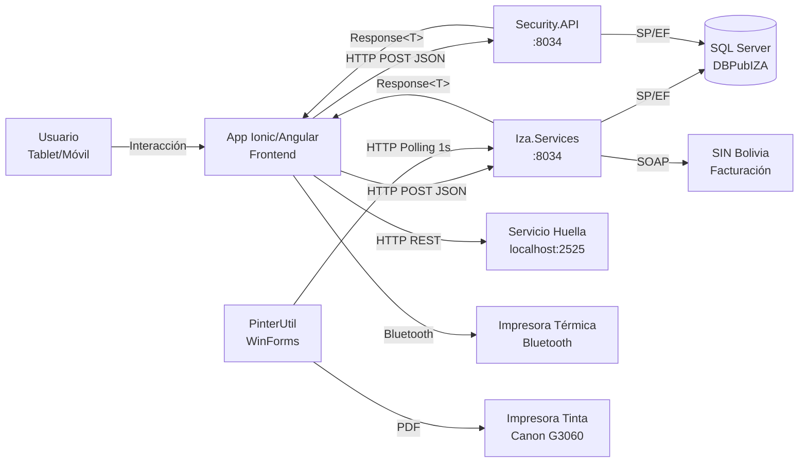
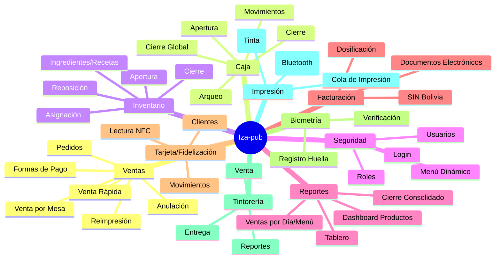

# Codegraph - Iza-pub

## Arquitectura General



## Estructura de Proyectos

### Backend (.NET 10)

```
Iza.Solution.sln
├── PlumbingProps            # Infraestructura (utilidades cross-cutting)
│   ├── Config               # ConfigManager
│   ├── CrossUtil            # Extensiones, Mail, MapHelper, Serializer
│   ├── Document             # Excel, Word, PDF, HTML
│   ├── Exceptions           # ManagerException
│   ├── Logger               # NLog (Binnacle + Event)
│   ├── Services             # ClientHelper HTTP
│   └── Wrapper              # Response<T> unificado
│
├── CoreAccesLayer           # Capa de acceso a datos
│   ├── Interface            # IRepository<T>, FactoryDataInterfaz
│   ├── Implement/SQLServer  # MSSQLRepository (EF Core + ADO.NET)
│   ├── Implement/MySQL      # MySQLRepository
│   └── Wraper               # Entity<T> (stateEntity)
│
├── Iza.Core                 # Lógica de negocio principal
│   ├── Base                 # BaseManager (abstract)
│   ├── DBEntities           # DbContext + 33 entidades (shFabula)
│   ├── Domain               # ~55 DTOs (Venta, Inventario, Reportes, etc.)
│   ├── Engine               # EngineVentas, Inventarios, Seguridad, Impresion, Backoffice
│   └── Reports              # DevExpress Reports
│
├── Security.Core            # Lógica de seguridad
│   ├── Base                 # BaseManager (abstract)
│   ├── DBEntities           # DbContext + 37 entidades (3 schemas)
│   ├── Domain               # Login/Menú DTOs
│   └── Engine               # EngineSecurity
│
├── Iza.Services             # API principal (ASP.NET Core)
│   └── Services             # 4 Controllers (Venta, Inventario, Seguridad, Backoffice)
│
├── Security.API             # API de seguridad independiente
│   └── Services             # 1 Controller (Security)
│
└── Iza.Core.Test            # Tests NUnit
```

### Frontend (Ionic 8 / Angular 18)

```
frontend/
├── src/app/
│   ├── app.module.ts        # NgModule raíz
│   ├── app-routing.module   # 40+ rutas lazy-loaded
│   ├── app.component        # Componente raíz
│   │
│   ├── components/          # 14 componentes compartidos
│   │   ├── menu/            # Menú dinámico desde backend
│   │   ├── busca-producto/
│   │   ├── forma-pago/
│   │   ├── finger-capture/  # Captura de huella
│   │   ├── reader-card/     # Lector NFC/tarjeta
│   │   ├── products-slides/ # Carrusel de productos
│   │   ├── custom-header/
│   │   ├── custom-calendar/
│   │   ├── custom-camera/
│   │   ├── detalle-ingredientes/
│   │   ├── lista-producto/
│   │   ├── datos-factura/
│   │   ├── registro-cliente-fac/
│   │   └── cliente/
│   │
│   ├── pages/               # 43 páginas
│   │   ├── venta/           # Venta principal
│   │   ├── venta-express/
│   │   ├── pedido-mesa/     # Pedidos por mesa
│   │   ├── bandeja-pedidos/ # Bandeja cocina/barra
│   │   ├── apertura-caja/
│   │   ├── cierre-caja/
│   │   ├── cierre-cajero/
│   │   ├── cierre-global/
│   │   ├── inventario-general/
│   │   ├── inventario-final/
│   │   ├── asignacion-inventario/
│   │   ├── dashboard-productos/
│   │   ├── abm-usuario/
│   │   ├── login/
│   │   ├── config-printer/
│   │   ├── tintoreria/      # Módulo tintorería (4 páginas)
│   │   ├── registro-huellas/
│   │   ├── verificacion-huella/
│   │   ├── control-tarjetas/
│   │   └── ... (40+)
│   │
│   ├── services/            # 11 servicios API
│   │   ├── baseService.ts
│   │   ├── seguridad.service.ts
│   │   ├── venta.service.ts
│   │   ├── stock.service.ts
│   │   ├── inventario.service.ts
│   │   ├── persona.service.ts
│   │   ├── tarjeta.service.ts
│   │   ├── finger.service.ts
│   │   ├── tintoreria.service.ts
│   │   ├── fabula.service.ts
│   │   └── documento.service.ts
│   │
│   ├── interfaces/          # ~50 modelos TypeScript
│   │   ├── venta/
│   │   ├── inventario/
│   │   ├── general/
│   │   ├── caja/
│   │   ├── tarjeta/
│   │   ├── tintoreria/
│   │   ├── reportes/
│   │   ├── printer/
│   │   └── wraper/
│   │
│   └── guards/              # sessioninit, sessionend
│
└── capacitor.config.json    # Android/iOS
```

### PinterUtil (.NET Framework 4.8 - Windows Forms)

```
PrinterGamatek.sln
└── PrinterGamatek/
    ├── Program.cs           # Entry point
    ├── Printer.cs           # Form principal + lógica
    ├── CleintService/       # HTTP client
    │   ├── ClientHelper.cs
    │   ├── PrinterLineRequest.cs
    │   ├── PrinterLineResponse.cs
    │   └── ResponseQuery.cs
    └── App.config           # URL, idPrinter, namePrinter, timeFoWait
```

## Diagrama de Flujo de Datos



## Stack Tecnológico

| Capa | Tecnología | Versión |
|------|-----------|---------|
| **Backend** | .NET | 10.0 |
| **Backend** | ASP.NET Core | 10.0 |
| **Backend** | Entity Framework Core | 9.x |
| **Backend** | DevExpress Reporting | 23.1 |
| **Backend** | SQL Server | (principal) |
| **Backend** | MySQL | (soporte) |
| **Backend** | NLog | (logging) |
| **Backend** | iText7 / QRCoder | (PDF/QR) |
| **Frontend** | Angular | 18.2 |
| **Frontend** | Ionic | 8.4 |
| **Frontend** | Capacitor | 8 |
| **Frontend** | DevExtreme | 24.2 |
| **Frontend** | Chart.js | 3.7 |
| **Frontend** | Ionic Storage | (sesión) |
| **Desktop** | .NET Framework | 4.8 |
| **Desktop** | Windows Forms | (WinForms) |
| **Desktop** | DevExpress PDF | 23.1 |
| **Testing** | NUnit / Jest | |

## Dominios de Negocio



## Endpoints de API

### Iza.Services (`http://155.138.212.216:8034/api/`)

| Controller | Endpoints | Función |
|-----------|-----------|---------|
| **APIVenta** | 22 POST | Ventas, caja, formas de pago, anulación, reimpresión, documentos |
| **APIIventario** | 13 POST | Inventarios, asignaciones, dashboard, ingredientes |
| **APISeguridad** | 3 POST | Login, cambio contraseña, menú por rol |
| **APIBackoffice** | (stub) | - |

### Security.API (`http://155.138.212.216:8034/api/`)

| Controller | Endpoints | Función |
|-----------|-----------|---------|
| **APISecurity** | 3 POST | Login, cambio contraseña, menú por rol |

## Patrones Arquitectónicos

- **Layered Architecture**: 4 capas (Infrastructure → Business → API → Tests)
- **Repository Pattern**: `IRepository<TDbContext>` con implementaciones MSSQL/MySQL
- **Factory Pattern**: `FactoryDataInterfaz` crea repositorio según provider
- **Unit of Work**: Transacciones vía `Commit()`/`Rollback()` en repositorio
- **Response Wrapper**: `Response<T>` unificado con Estado (Success/Warning/Error/NoData)
- **Lazy Loading**: 40+ módulos Angular cargados bajo demanda
- **Guard Pattern**: `SessioninitGuard` / `SessionendGuard` para control de acceso